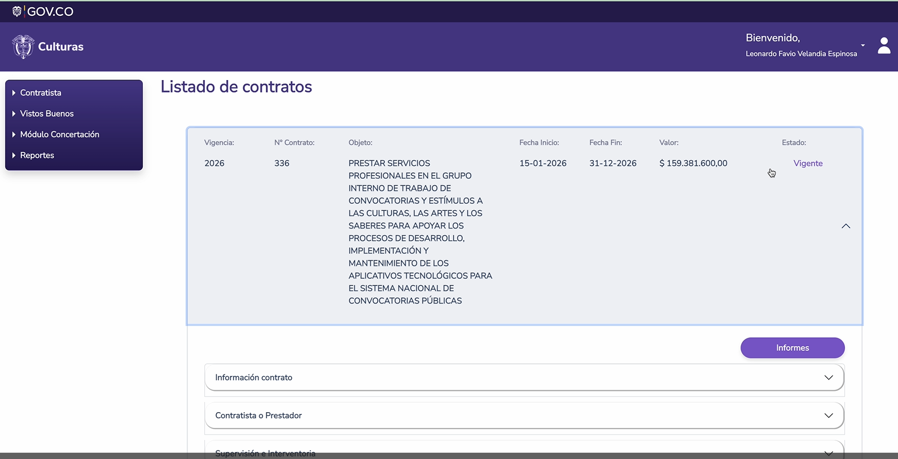

# Proyecto - Gestión de Contratos

Voy a escribir una descripción de lo que sería una aplicación para la gestión de contratos en la Secretaría de Educación. Estoy tomando como referencia una aplicación del Ministerio de Cultura. La idea es simular este flujo funcional, pero utilizando o construyendo más bien con patrones de desarrollo como el SDD (Spec Driven Development), adicional a esto, utilizando toda la base de conocimiento que ya tenemos en la Secretaría de Educación. 

Clave: en el alcance de este proyecto, inicialmente, son gestión de contratos de persona natural, u "OPS". A posteriori, este proyecto tiene que crecer en función de también manejar toda la gestión de contratos de proveedores, personas jurídicas. De momento, el desarrollo va a centrarse en funcionalidades de persona natural.

PERFILES

A nivel de perfiles, cada contratista va a tener un usuario y un password. Si la forma como hoy cada contratista desarrolla su logueo a través de autenticación vía Microsoft 365 es en producción, para temas en desarrollo podemos simularlo con un single login.

Entonces, ese usuario contratista, su función principal va a ser la de cargar informes o la de generar informes con sus respectivas obligaciones, adjuntando el detalle de las actividades realizadas en un periodo correspondiente y adjuntando los soportes respectivos que ahí corresponden. Una vez que termine ese informe, pues se enviará a un flujo de aprobación.

Hay un segundo perfil que es de revisor, cuyo rol principal es apoyo a la supervisión, en el cual él hace una verificación en la completitud del informe y da su visto bueno o su revisión.

Y hay un tercer perfil de aprobación que directamente corresponde al supervisor del contrato, que es el que estampa la última validación correspondiente.

Importante que, en cada uno de estos flujos, exista alguna opción para que estos usuarios dejen configurada su firma digital, para que luego ésta pueda agregarse en la generación del PDF, del formato, al final del ejercicio.

___________________________________________________________________________________________________

NOTAS IMPORTANTES

Si bien los contratos tienen un ciclo de vida desde su parte precontractual hasta la liquidación y el cierre, este aplicativo inicialmente se va a centrar en la premisa de que todos los contratos que se visualizan acá y que se gestionan son contratos que están en ejecución. A estos se les puede agregar esa correlación de informes, actividades y soportes para que dispara claramente otras acciones que están fuera del alcance de este proyecto, como el tema de pagos para los proyectos que ya están liquidados simplemente o cerrados y ya quedaron simplemente como consulta histórica de qué informe se cargaron en etapa de ejecución.

Importante tener en cuenta que los contratos tienen un ciclo de vida como en el SECOP2. Mantener esa correlación.

___________________________________________________________________________________________________

DESCRIPCION DE FUNCIONALIDADES PRINCIPALES

Módulo 1 de Logueo sin ningún tipo de característica distinta a la que ya hemos desplegado en otras aplicaciones tipo

Entonces, el flujo al ingresar como un contratista, lo que me va a aparecer son los contratos que yo tengo asociados a la entidad como funcionalidad número uno. Comparto la pantalla.

Es importante indicar que por cada contrato hay una información base ya cargada, que es la hoja de vida de cada contrato.

Existe una relación entre contrato y supervisión interventoria. Cada contrato tiene un supervisor nombrado.

Por cada contrato hay un historial de informe en el que marca la fecha de aprobación y la opción de poder descargarlo en PDF.

Al hacer clic en cada contrato, me va a llevar a otra opción en la cual me permite hacer gestión sobre cada uno de los informes asociados a este contrato.

Posterior a esto también se encuentra la opción de "nuevo informe", la cual se dispararía inicialmente con una fecha de inicio y una fecha de fin para ese informe.

El primer estado uniforme cuando está en proceso es borrador. Cuando está en proceso de construcción, este proceso borrador permite también como una opción de edición. 

Por cada informe ya hay una relación que corresponde a cada contrato. Dentro del contrato se van a generar un informe y dentro de ese informe, van a estar relacionadas las obligaciones contractuales que, para este caso de este ejemplo, se llaman actividades. 

Por cada obligación, se debe poner la actividad relacionada y el porcentaje.

Adicional, por cada obligación que tenga su respectiva actividad, yo puedo y debo adjuntar los soportes a esa obligación.

Ahí puedo adjuntar, a nivel de soporte, el URL o el archivo.

Tengo la capacidad de agregar algunas actividades no relacionadas a la obligación contractual y poner algunos documentos adicionales de soporte.

Hay una lista de formatos precargados que puede ser la planilla de aportes y pagos de seguridad social. Acá pudiese, para el caso de la Secretaría, agregar el soporte de correspondencia. Esto puede ser o debería ser parametrizable: el tema de los documentos anexos a cargar por cada informe correspondiente a cada periodo, cada periodo asociado a un contrato.

Hay unas opciones preliminares de previsualización, como "Ver informe", y ya hay un segundo paso, el cual permite enviar, cuando ya estemos de acuerdo, que es "Enviar al supervisor". Debería haber como un mecanismo de confirmación, y aquí ya se dispararía alguna acción automática de notificación al supervisor para saber que ya le llegó ese informe para aprobar.

Aquí anexo un informe tipo correspondiente al documento y al PDF que se genera luego.

[06_Informe_actividades_06_Abril_2026_Juan_Escandon.docx](06_Informe_actividades_06_Abril_2026_Juan_Escandon.docx)