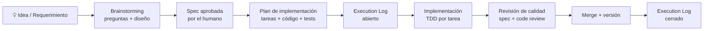

# Desarrollo de Software con IA: Metodología SDD + Superpowers

> **Audiencia:** Desarrolladores, líderes técnicos y arquitectos.
> **Propósito:** Explicar cómo trabajar de forma estructurada con un agente de IA
> para producir software de calidad, usando Spec-Driven Development (SDD) como
> marco metodológico y un conjunto de capacidades (skills) como herramientas de ejecución.

---

## 1. El Cambio de Paradigma

Trabajar con un agente de IA en desarrollo de software no es lo mismo que pedirle
a alguien que escriba código por ti. La diferencia fundamental está en quién
**piensa** y quién **ejecuta**.

```
Paradigma tradicional:          Paradigma IA-asistida:
─────────────────────           ─────────────────────────────────────
Humano → piensa                 Humano → decide, gobierna, aprueba
Humano → diseña                 IA → analiza, propone, implementa
Humano → codifica               Humano → valida en cada gate de calidad
Humano → prueba                 IA → escribe tests, código y documentación
Humano → documenta              Humano → merge y control de versiones
```

El humano no delega el criterio: delega la ejecución. **La IA amplifica la
capacidad del ingeniero; no la reemplaza.**

Esto exige estructura. Sin ella, la IA genera código rápido pero descontrolado.
Con ella, cada incremento es trazable, revisado y alineado con los requisitos.

---

## 2. Spec-Driven Development (SDD)

SDD es el marco que impone el orden. La regla es simple:

> **No se toca código sin antes tener una spec aprobada y un plan de implementación.**

### El flujo obligatorio



Cada artefacto tiene un propósito concreto:

| Artefacto | Propósito | Quién lo aprueba |
|-----------|-----------|-----------------|
| **Spec** (`docs/specs/`) | Qué se construye y por qué | Humano |
| **Plan** (`docs/superpowers/plans/`) | Cómo se construye, paso a paso | Humano |
| **Execution Log** (`docs/plans/`) | Trazabilidad de lo ejecutado | IA + Humano |

### Por qué importa el orden

- La **spec** congela el alcance antes de tocar código. Evita el scope creep.
- El **plan** obliga a pensar en la implementación completa antes de arrancar.
  Los errores de diseño se encuentran en el papel, no en el código.
- El **execution log** es la memoria del incremento: qué se hizo, qué commit,
  qué validación pasó. Permite retomar trabajo o hacer audit trail.

### Ejemplo del mundo real

En el proyecto SIGCON, el incremento de seguridad (I-SEC) siguió este flujo:

```
Requerimiento: cumplir checklist SED de seguridad N2
       ↓
Análisis de 67 criterios → 6 brechas identificadas
       ↓
Design doc: cuáles son de código vs de infraestructura (decisión humana)
       ↓
Spec aprobada: SEC-01, SEC-03, SEC-04, SEC-06 → código
               SEC-02, SEC-05 → documentar decisión arquitectural
       ↓
Plan: T0 docs → T1 architecture → T2 headers/CORS → T3 validación archivos → T4 cierre
       ↓
Implementación: 4 commits feat + 5 commits docs, 182 tests, 0 fallos
```

---

## 3. Las Skills: Capacidades del Agente

Las **skills** son módulos de comportamiento especializado que se activan
explícitamente. Cada skill le dice al agente cómo pensar y actuar para un tipo
específico de trabajo. Sin skills, el agente improvisa. Con skills, sigue
un proceso probado.

### Mapa de skills por fase del ciclo

```
┌─────────────────────────────────────────────────────────────────┐
│                    CICLO SDD COMPLETO                           │
├──────────────┬──────────────────┬──────────────────────────────┤
│   DISEÑO     │  PLANIFICACIÓN   │      IMPLEMENTACIÓN          │
│              │                  │                              │
│ brainstorming│ writing-plans    │ subagent-driven-development  │
│              │                  │ executing-plans              │
│              │                  │ superpowers:code-reviewer    │
│              │                  │ finishing-a-development-branch│
└──────────────┴──────────────────┴──────────────────────────────┘
```

---

### 3.1 `brainstorming` — Diseño colaborativo

**Cuándo usarla:** Al inicio de cualquier requerimiento nuevo.

**Qué hace:**
- Analiza el estado actual del código antes de proponer nada.
- Hace preguntas una a la vez para entender restricciones, alcance y criterios de éxito.
- Propone 2-3 enfoques con trade-offs y una recomendación fundamentada.
- Presenta el diseño en secciones y espera aprobación explícita de cada una.
- Escribe el design doc y espera revisión humana antes de avanzar.

**Por qué aporta valor:**
El agente no puede saber el contexto de negocio, las restricciones institucionales
ni las decisiones de arquitectura previas sin preguntar. Brainstorming sistematiza
ese diálogo. En I-SEC, esta skill identificó que CSRF no requería cambio de código
(JWT Bearer lo resuelve por diseño) y que rate limiting era responsabilidad del WAF
de infraestructura — dos decisiones que sin el diálogo habrían generado código
innecesario.

**Gate de salida:** Design doc escrito, revisado y aprobado por el humano.

---

### 3.2 `writing-plans` — Plan de implementación detallado

**Cuándo usarla:** Después de que el humano aprueba el design doc.

**Qué hace:**
- Mapea todos los archivos a crear o modificar antes de escribir una línea.
- Descompone el trabajo en tareas de 2-5 minutos: escribe el test → falla → implementa → pasa → commit.
- Incluye el código exacto en cada paso (sin "TBD", sin "implementar aquí").
- Hace self-review del plan contra la spec antes de entregarlo.

**Por qué aporta valor:**
Un plan bien escrito convierte la implementación en ejecución mecánica. El agente
implementador recibe instrucciones tan precisas que puede ejecutarlas con contexto
mínimo — lo que significa menos errores y más velocidad. Si el plan tiene un error,
se detecta en el papel antes de tocar el código.

**Gate de salida:** Plan guardado, revisado por el humano, listo para ejecutar.

---

### 3.3 `subagent-driven-development` — Ejecución con subagentes

**Cuándo usarla:** Para ejecutar el plan, tarea por tarea.

**Qué hace:**
```
Por cada tarea:
  1. Despacha un subagente implementador (contexto fresco, sin ruido de sesión)
  2. El subagente implementa con TDD estricto
  3. Despacha revisor de spec → ¿el código coincide exactamente con la spec?
  4. Despacha revisor de calidad → ¿el código es correcto y robusto?
  5. Si hay issues: el implementador los corrige → re-revisión
  6. Solo cuando ambos revisores aprueban → avanza a la siguiente tarea
```

**Por qué aporta valor:**
Cada subagente empieza con contexto limpio. Esto evita que el agente "se confunda"
entre tareas y arrastre decisiones equivocadas de una tarea a otra. La revisión
en dos etapas (spec + calidad) actúa como un CI/CD conceptual: detecta desvíos
antes de que se acumulen.

En I-SEC, el revisor de calidad detectó una ambigüedad en el scope de `Cache-Control`
entre la tabla de headers y el criterio de aceptación — se corrigió antes de
implementar T2, lo que evitó una implementación incorrecta.

**Gate de salida:** Todos los revisores aprueban, todos los tests pasan.

---

### 3.4 `superpowers:code-reviewer` — Revisión final del incremento

**Cuándo usarla:** Al terminar todas las tareas del plan, antes del merge.

**Qué hace:**
- Lee el código del incremento completo con criterio de seguridad y corrección.
- Filtra: solo reporta problemas reales con impacto (no style issues menores).
- Clasifica: problemas críticos (bloquean merge) vs observaciones (no bloquean).
- Da un veredicto explícito: LISTO PARA MERGE o REQUIERE CORRECCIONES.

**Por qué aporta valor:**
Los revisores por tarea verifican el plan. El revisor final verifica la coherencia
del incremento completo. En I-SEC encontró que un CORS vacío tenía comportamiento
defensivo correcto (bloquea todo) pero sin log de advertencia — observación válida
que se documentó como trabajo futuro sin bloquear el merge.

**Gate de salida:** LISTO PARA MERGE con veredicto documentado.

---

### 3.5 `finishing-a-development-branch` — Cierre y merge

**Cuándo usarla:** Cuando el revisor final da el visto bueno.

**Qué hace:**
- Verifica que los tests pasen en la rama feature.
- Presenta exactamente 4 opciones (merge local, PR, mantener, descartar).
- Ejecuta la opción elegida: merge + limpieza de branch + limpieza de worktree.
- Actualiza la versión si se indica.

**Por qué aporta valor:**
Estandariza el cierre. Sin esta skill, el merge y la limpieza de worktrees se hace
de forma inconsistente. Con ella, cada incremento cierra de la misma manera,
dejando el repositorio en estado conocido.

---

## 4. El Rol del Humano: Dónde Está el Control

La IA ejecuta, pero el humano gobierna. Los gates obligatorios donde el humano
debe aprobar explícitamente:

```
┌─────────────────────────────────────────────────────────┐
│              GATES DE APROBACIÓN HUMANA                 │
├─────────────────────────────────────────────────────────┤
│  1. Diseño aprobado (brainstorming → spec)              │
│     "¿Esta es la solución correcta al problema?"        │
├─────────────────────────────────────────────────────────┤
│  2. Plan aprobado (writing-plans → plan)                │
│     "¿Este es el camino de implementación correcto?"    │
├─────────────────────────────────────────────────────────┤
│  3. Merge aprobado (finishing-a-development-branch)     │
│     "¿Esto entra a main?"                               │
└─────────────────────────────────────────────────────────┘
```

Entre gates, el agente trabaja autónomamente. El humano no necesita aprobar
cada commit ni cada test — solo los puntos donde una decisión equivocada
costaría retrabajo significativo.

### Lo que el humano NO delega

- **Alcance:** Qué entra y qué no entra en el incremento.
- **Decisiones de arquitectura:** Por ejemplo, "CSRF lo maneja el diseño JWT, no el código".
- **Criterios de calidad:** Cuándo algo es "suficientemente bueno" para producción.
- **Merge:** El código no entra a main sin aprobación explícita.

---

## 5. TDD como Práctica Central

Todas las skills de implementación asumen TDD estricto. No es negociable:

```
RED   →  Escribe el test. Corre. Confirma que falla.
GREEN →  Escribe el mínimo código para que pase.
        Corre. Confirma que pasa.
COMMIT → Código + test en el mismo commit.
```

**Por qué la IA necesita TDD más que un humano:**
Un desarrollador humano puede tener el criterio de "esto parece correcto" sin
escribir el test primero. Un agente de IA puede generar código que compila y
parece correcto pero no hace lo que la spec dice. El test primero es la
especificación ejecutable — la única forma de saber que el agente entendió
el requerimiento.

En I-SEC, el test `storeFile_extensionNoPermitida_lanzaSoporteFormatoInvalido`
falló en RED antes de que existiera `SOPORTE_FORMATO_INVALIDO` en `ErrorCode`.
Eso confirmó que el test estaba bien escrito y que la implementación era la
correcta para hacerlo pasar.

---

## 6. Anatomía de un Incremento Bien Ejecutado

Un incremento sigue este patrón de artefactos y commits:

```
docs/superpowers/specs/YYYY-MM-DD-feature-design.md   ← diseño (brainstorming)
docs/superpowers/plans/YYYY-MM-DD-feature.md          ← plan (writing-plans)
docs/specs/YYYY-MM-DD-feature-spec.md                 ← spec técnica (T0)
docs/plans/YYYY-MM-DD-feature-execution-log.md        ← log de ejecución (T0..Tn)

commits:
  docs(feat): add design doc and spec
  docs(feat): add implementation plan and execution log
  feat(feat): [implementación T1 — archivos + tests]
  feat(feat): [implementación T2 — archivos + tests]
  docs(feat): close execution log
  merge(feat): merge into main
  chore: bump version to X.Y.Z
```

Cada commit de código incluye tests. Ningún commit de código va sin test asociado.

---

## 7. Buenas Prácticas del Equipo

### Para el que trabaja con el agente

| Práctica | Razón |
|----------|-------|
| Aprueba el diseño por secciones, no de una vez | Encontrar problemas temprano es más barato |
| Lee el plan antes de ejecutarlo | El plan tiene el código — si algo parece raro, corrígelo antes de implementar |
| No saltes gates de revisión aunque "parezca simple" | La complejidad oculta aparece en los gates |
| Usa nombres de incremento consistentes | Los logs y specs se vuelven el historial del proyecto |
| Documenta las decisiones que NO generan código | Son tan importantes como las que sí lo generan |

### Para el equipo que adopta la metodología

| Práctica | Razón |
|----------|-------|
| Un incremento = una rama = un conjunto de artefactos | La trazabilidad depende de que todo esté vinculado |
| La spec es la fuente de verdad, no el código | El código cambia; la spec explica el por qué |
| Los criterios de aceptación van en la spec, no en la cabeza | El revisor los verifica contra ellos |
| El execution log es el diario del incremento | Permite retomar trabajo después de semanas o pasárselo a otro |

---

## 8. Errores Comunes al Adoptar esta Metodología

**"La spec es burocracia, vamos directo al código"**
→ Sin spec, el agente genera código que puede ser técnicamente correcto pero
funcionalmente equivocado. La spec es la única defensa contra eso.

**"El agente revisó su propio código, ya está revisado"**
→ El self-review del agente encuentra errores mecánicos. El revisor externo
(skill `code-reviewer`) encuentra problemas de diseño y coherencia con la spec.
Son complementarios, no intercambiables.

**"Puedo pedirle al agente que haga todo en un solo mensaje"**
→ Los agentes trabajan mejor con contexto acotado. Una tarea bien definida
produce mejor resultado que un requerimiento amplio. La descomposición en tareas
no es overhead — es lo que hace que el código sea mantenible.

**"No necesito el execution log si tengo git log"**
→ El git log dice qué cambió. El execution log dice por qué, qué validaciones
pasaron y cuál era el estado esperado. Son complementarios.

---

## 9. Resumen Visual del Ciclo Completo

```
 HUMANO                              AGENTE (con skills)
 ──────                              ───────────────────

 Describe el requerimiento
                              ←──── brainstorming: analiza contexto
                              ←──── brainstorming: hace preguntas
 Responde preguntas           ────►
                              ←──── brainstorming: propone diseño
 Aprueba diseño               ────►
                              ←──── brainstorming: escribe spec
 Revisa y aprueba spec        ────►
                              ←──── writing-plans: escribe plan detallado
 Revisa y aprueba plan        ────►
                              ←──── subagent: implementa T1 (TDD)
                              ←──── subagent: revisor spec T1
                              ←──── subagent: revisor calidad T1
                              ←──── subagent: implementa T2 (TDD)
                                    ... (T3, T4, ...)
                              ←──── code-reviewer: revisión final
 Aprueba merge                ────►
                              ←──── finishing: merge + versión + limpieza
```

---

## 10. Arrancar con la Metodología: Checklist Mínimo

Para usar SDD con IA en un proyecto nuevo o incremento existente:

- [ ] Identificar el requerimiento y el alcance inicial (¿qué entra, qué no?)
- [ ] Abrir sesión y activar `brainstorming` antes de cualquier código
- [ ] Aprobar el design doc por secciones
- [ ] Activar `writing-plans` para generar el plan
- [ ] Leer el plan completo antes de ejecutar
- [ ] Activar `subagent-driven-development` para implementación
- [ ] No saltarse los gates de revisión (spec + calidad por tarea)
- [ ] Activar `superpowers:code-reviewer` al terminar todas las tareas
- [ ] Activar `finishing-a-development-branch` para merge y cierre
- [ ] Verificar que el execution log queda cerrado con todos los SHAs

---

*Documento generado a partir de la experiencia del proyecto SIGCON — SED Bogotá.*
*Metodología: Spec-Driven Development + Anthropic Claude Code Superpowers.*
